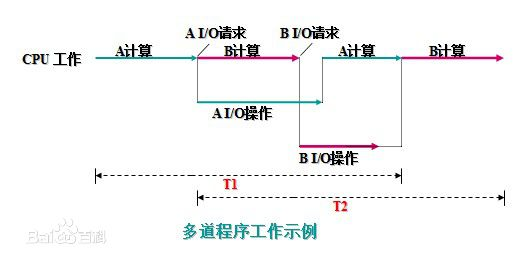
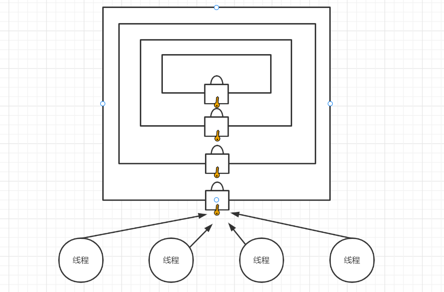

# 并发编程

并发编程是一项比较庞大而复杂并且非常重要的技术，无论在面试，还是工作中出现的频率非常高。而我们要学习并发编程，首先要清晰一些基本概念。

## 基本概念

### 操作系统发展史

#### 史前时代

##### 手工操作 —— 穿孔卡片

1946年第一台计算机诞生--20世纪50年代中期，计算机工作还在采用手工操作方式。此时还没有操作系统的概念，属于第一代计算机。

     

程序员将对应于程序和数据的穿孔卡片（punched card，就是一张纸卡片，这个纸卡片被分为N行M列的格子）装入输入机，然后启动输入机把程序和数据输入计算机内存，接着通过控制台开关启动程序针对数据运行；计算完毕，打印机输出计算结果；用户取走结果并穿孔卡片后，才让下一个用户上机。

手工操作方式3个特点：

1.  一个用户独占全机。不会出现因资源已被其他用户占用而等待的现象，但资源的利用率低。
2.  CPU等待用户手工录入输入，而这个等待过程中，CPU是并没有工作的或没有被利用上的。
3.  同一时刻只有一个程序在内存中被CPU调用运行（串行的）

由于当时的计算机非常昂贵的设备，很自然的人们就希望更高效的使用计算机完成工作任务。所以20世纪50年代后期，随着计算机的推广，人机矛盾问题日益尖锐：手工操作的慢速度和计算机的高速度之间形成了尖锐矛盾，手工操作方式已严重损害了系统资源的利用率（使资源利用率降为百分之几，甚至更低），不能容忍。要解决人机矛盾，就要考虑CPU的利用率问题。唯一的解决办法：只有摆脱人的手工操作，实现作业的自动过渡。这样就出现了批处理系统，计算机发展进入了第二代计算机时代。

##### 批处理系统 —— 磁带存储

批处理系统，加载在计算机上的一个系统软件，在它的控制下，计算机能够自动地、成批地处理一个或多个用户的作业（这作业包括程序、数据和命令）。

###### 联机批处理系统

首先出现的是联机批处理系统，即作业的输入/输出由CPU来处理。


主机与输入机之间增加一个存储设备——磁带，在运行于主机上的监督程序的自动控制下，计算机可自动完成：成批地把输入机上的用户作业读入磁带，依次把磁带上的用户作业读入主机内存并执行并把计算结果向输出机输出。完成了上一批作业后，监督程序又从输入机上输入另一批作业，保存在磁带上，并按上述步骤重复处理。

监督程序不停地处理各个作业，从而实现了作业到作业的自动转接，减少了作业建立时间和手工操作时间，有效缓解了人机矛盾，提高了计算机的CPU利用率。

但是在作业输入和结果输出时，主机的高速CPU仍处于空闲状态，等待慢速的输入/输出设备完成工作： 主机处于“忙等”状态。

###### 脱机批处理系统

为克服与缓解高速主机与慢速外设的矛盾，为了更有效的提高CPU的利用率，又引入了脱机批处理系统，即输入/输出脱离主机控制。


   

卫星机：一台不与主机直接相连而专门用于与输入/输出设备打交道的。其功能是：

1.  从输入机上读取用户作业并放到输入磁带上。
2.  从输出磁带上读取执行结果并传给输出机。

这样，主机不是直接与慢速的输入/输出设备打交道，而是与速度相对较快的磁带机发生关系，也进一步的缓解了主机与设备的矛盾。主机与卫星机可并行工作，二者分工明确，可以充分发挥主机的高速计算能力。

脱机批处理系统：20世纪60年代应用十分广泛，它极大缓解了人机矛盾及主机与外设的矛盾。

但仍然存在不足之处：每次主机内存中仅存放一道作业，每当它运行期间发出输入/输出（I/O）请求后，高速的CPU便处于等待低速的I/O完成状态，致使CPU处于空闲状态。

所以为了进一步改善和提高CPU的利用率，又出现了多道程序系统（第一次出现了操作系统的概念，），计算机的发展进入了第三代计算机时代。

#### 多道系统

CPU在执行一个任务的过程中，若需要操作硬盘，则发送操作硬盘的指令，指令一旦发出，硬盘上的机械手臂滑动读取数据到内存中，这一段时间内CPU需要等待，时间可能很短，但对于cpu来说已经很长很长，长到可以让CPU做很多其他的任务，如果我们让CPU在这段时间内切换到去做其他的任务，这样CPU就可以得到充分利用了，于是产生了多道技术（多道程序设计技术）。

##### 多道程序设计技术

所**谓多道程序设计技术，就是指允许多个程序同时进入内存并运行**。即同时把多个程序放入内存，并允许它们交替在CPU中运行，它们共享系统中的各种硬、软件资源。当一道程序因I/O请求而暂停运行时，CPU便立即转去运行另一道程序。


在A程序计算时，I/O空闲， A程序I/O操作时，CPU空闲（B程序也是同样）；必须A工作完成后，B才能进入内存中开始工作，两者是串行的，全部完成共需时间=T1+T2。

  

将A、B两道程序同时存放在内存中，它们在系统的控制下，可相互穿插、交替地在CPU上运行：当A程序因请求I/O操作而放弃CPU时，B程序就可占用CPU运行，这样 CPU不再空闲，而正进行A I/O操作的I/O设备也不空闲，显然，CPU和I/O设备都处于“忙”状态，大大提高了资源的利用率，从而也提高了系统的效率，A、B全部完成所需时间<<T1+T2。

多道程序设计技术不仅使CPU得到充分利用，同时改善I/O设备和内存的利用率，从而提高了整个系统的资源利用率和系统吞吐量（单位时间内处理作业（程序）的个数），最终提高了整个系统的效率。

单处理机系统中多道程序运行时的特点：

1.  多道：计算机内存中同时存放几道相互独立的程序；
2.  宏观上并行：同时进入系统的几道程序都处于运行过程中，即它们先后开始了各自的运行，但都未运行完毕；
3.  微观上串行：实际上，各道程序轮流地用CPU，并交替运行。

多道程序系统的出现，标志着操作系统渐趋成熟的阶段，先后出现了作业调度管理（时间隔离，短作业优先算法+先来先服务算法）、处理机管理、存储器管理（实现空间隔离，隔离不同应用程序的数据）、外部设备管理、文件系统管理等功能。

由于多个程序同时在计算机中运行，开始有了空间隔离的概念，只有内存空间的隔离，才能让数据更加安全、稳定。

除了空间隔离之外，多道技术还第一次体现了时空复用的特点，遇到IO操作就切换程序，使得cpu的利用率提高了，计算机的工作效率也随之提高。

##### 多道批处理系统

20世纪60年代中期，在前述的批处理系统中，引入多道程序设计技术后形成多道批处理系统（简称：批处理系统）。它有两个特点：

1.  多道：系统内可同时容纳多个作业。这些作业放在外存中，组成一个后备队列，系统按一定的调度原则每次从后备作业队列中选取一个或多个作业进入内存运行，运行作业结束、退出运行和后备作业进入运行均由系统自动实现，从而在系统中形成一个自动转接的、连续的作业流。
2.  成批：在系统运行过程中，不允许用户与其作业发生交互作用，即：作业一旦进入系统，用户就不能直接干预其作业的运行。

批处理系统的追求目标：提高系统资源利用率和系统吞吐量，以及作业流程的自动化。

批处理系统的一个重要缺点：不提供人机交互能力，给用户使用计算机带来不便。

虽然用户独占全机资源，并且直接控制程序的运行，可以随时了解程序运行情况。但这种工作方式因独占全机造成资源效率极低。

一种新的追求目标：既能保证计算机效率，又能方便用户使用计算机。 20世纪60年代中期，计算机技术和软件技术的发展使这种追求成为可能。计算机进入了第四代计算机时代。

#### 分时系统

由于CPU速度不断提高和采用分时技术，一台计算机可同时连接多个用户终端，而每个用户可在自己的终端上联机使用计算机，好象自己独占机器一样。

分时技术：把处理机的运行时间分成很短的时间片，按时间片轮流把处理机分配给各联机作业使用。

若某个作业在分配给它的时间片内不能完成其计算，则该作业暂时中断，把处理机让给另一作业使用，等待下一轮时再继续其运行。由于计算机速度很快，作业运行轮转得很快，给每个用户的印象是，好象他独占了一台计算机。而每个用户可以通过自己的终端向系统发出各种操作控制命令，在充分的人机交互情况下，完成作业的运行。

具有上述特征的计算机系统称为分时系统，它允许多个用户同时联机使用计算机。特点：

1.  多路性。若干个用户同时使用一台计算机。微观上看是各用户轮流使用计算机；宏观上看是各用户并行工作。
2.  交互性。用户可根据系统对请求的响应结果，进一步向系统提出新的请求。这种能使用户与系统进行人机对话的工作方式，明显地有别于批处理系统，因而，分时系统又被称为交互式系统。
3.  独立性。用户之间可以相互独立操作，互不干扰。系统保证各用户程序运行的完整性，不会发生相互混淆或破坏现象。
4.  及时性。系统可对用户的输入及时作出响应。分时系统性能的主要指标之一是响应时间，它是指：从终端发出命令到系统予以应答所需的时间。

分时系统的主要目标：对用户响应的及时性，即不至于用户等待每一个命令的处理时间过长。

分时系统可以同时接纳数十个甚至上百个用户，由于内存空间有限，往往采用对换（又称交换）方式的存储方法。即将未“轮到”的作业放入磁盘，一旦“轮到”，再将其调入内存；而时间片用完后，又将作业存回磁盘（俗称“滚进”、“滚出“法），使同一存储区域轮流为多个用户服务。

多用户分时系统是当今计算机操作系统中最普遍使用的一类操作系统。

注意：分时系统的分时间片工作，在没有遇到IO操作的时候就用完了自己的时间片被切走了，这样的切换工作其实并没有提高cpu的效率，反而使得计算机的效率降低了。但是我们牺牲了一点效率，却实现了多个程序共同执行的效果，这样用户就可以在计算机上一边听音乐一边聊QQ了，从而提高了用户体验。

#### 实时系统

虽然多道批处理系统和分时系统能获得较令人满意的资源利用率和系统响应时间，但却不能满足实时控制与实时信息处理两个应用领域的需求。于是就产生了实时系统，即系统能够及时响应随机发生的外部事件，并在严格的时间范围内完成对该事件的处理。

实时系统在一个特定的应用中常作为一种控制设备来使用。

实时系统可分成两类：

1.  实时控制系统。当用于飞机飞行、导弹发射等的自动控制时，要求计算机能尽快处理测量系统测得的数据，及时地对飞机或导弹进行控制，或将有关信息通过显示终端提供给决策人员。当用于轧钢、石化等工业生产过程控制时，也要求计算机能及时处理由各类传感器送来的数据，然后控制相应的执行机构。
2.  实时信息处理系统。当用于预定飞机票、查询有关航班、航线、票价等事宜时，或当用于银行系统、情报检索系统时，都要求计算机能对终端设备发来的服务请求及时予以正确的回答。此类对响应及时性的要求稍弱于第一类。

实时操作系统的主要特点：

1.  及时响应。每一个信息接收、分析处理和发送的过程必须在严格的时间限制内完成。
2.  高可靠性。需采取冗余措施，双机系统前后台工作，也包括必要的保密措施等。

```
分时：
	现在流行的服务器都是采用这种运行模式，即把CPU的运行分成若干时间片分别处理不同的运算请求
	linux系统
实时：
	一般用于单片机上、PLC等，比如电梯的上下控制中，对于按键等动作要求进行实时处理 
```


#### 通用操作系统

操作系统的三种基本类型：多道批处理系统、分时系统、实时系统。

通用操作系统：具有多种类型操作特征的操作系统。可以同时兼有多道批处理、分时、实时处理的功能，或其中两种以上的功能。

例如：实时处理+批处理=实时批处理系统。首先保证优先处理实时任务，插空进行批处理作业。常把实时任务称为前台作业，批作业称为后台作业。

再如：分时处理+批处理=分时批处理系统。即：时间要求不强的作业放入“后台”（批处理）处理，需频繁交互的作业在“前台”（分时）处理，处理机优先运行“前台”作业。

从上世纪60年代中期，国际上开始研制一些大型的通用操作系统。这些系统试图达到功能齐全、可适应各种应用范围和操作方式变化多端的环境的目标。但是，这些系统过于复杂和庞大，不仅付出了巨大的代价，且在解决其可靠性、可维护性和可理解性方面都遇到很大的困难。

相比之下，UNIX操作系统却是一个例外。这是一个通用的多用户分时交互型的操作系统。它首先建立的是一个精干的核心，而其功能却足以与许多大型的操作系统相媲美，在核心层以外，可以支持庞大的软件系统。它很快得到应用和推广，并不断完善，对现代操作系统有着重大的影响。

至此，操作系统的基本概念、功能、基本结构和组成都已形成并渐趋完善。

#### 操作系统的进一步发展

进入20世纪80年代，大规模集成电路工艺技术的飞跃发展，微处理机的出现和发展，掀起了计算机大发展大普及的浪潮。一方面迎来了个人计算机的时代，同时又向计算机网络、分布式处理、巨型计算机和智能化方向发展。于是，操作系统有了进一步的发展，如：个人计算机操作系统、网络操作系统、分布式操作系统等。

##### 个人计算机操作系统

个人计算机上的操作系统是联机交互的单用户操作系统，它提供的联机交互功能与通用分时系统提供的功能很相似。

由于是个人专用，因此一些功能会简单得多。然而，由于个人计算机的应用普及，对于提供更方便友好的用户接口和丰富功能的文件系统的要求会愈来愈迫切。

##### 网络操作系统

计算机网络：通过通信设施，将地理上分散的、具有自治功能的多个计算机系统互连起来，实现信息交换、资源共享、互操作和协作处理的系统。

网络操作系统：在原来各自计算机操作系统上，按照网络体系结构的各个协议标准增加网络管理模块，其中包括：通信、资源共享、系统安全和各种网络应用服务。

##### 分布式操作系统

表面上看，分布式系统与计算机网络系统没有多大区别。分布式操作系统也是通过通信网络，将地理上分散的具有自治功能的数据处理系统或计算机系统互连起来，实现信息交换和资源共享，协作完成任务。——硬件连接相同。

但有如下一些明显的区别：

1.  分布式系统要求一个统一的操作系统，实现系统操作的统一性。
2.  分布式操作系统管理分布式系统中的所有资源，它负责全系统的资源分配和调度、任务划分、信息传输和控制协调工作，并为用户提供一个统一的界面。
3.  用户通过这一界面，实现所需要的操作和使用系统资源，至于操作定在哪一台计算机上执行，或使用哪台计算机的资源，则是操作系统完成的，用户不必知道，此谓：系统的透明性。
4.  分布式系统更强调分布式计算和处理，因此对于多机合作和系统重构、坚强性和容错能力有更高的要求，希望系统有：更短的响应时间、高吞吐量和高可靠性。

前面的学习中，我们已经了解了计算机操作系统的历史背景，那么这跟我们学习的并发编程有什么关系呢？OK，这么来说，如果对操作系统的多道技术、分时技术、时空复用、数据隔离、多任务等技术，一点概念都没有的话，那么并发编程就无从说起了，所以了解了操作系统的历史背景以后，我们就可以清晰一个目的：并发编程是为了追求编写的编程对CPU利用率更高的，性能更好。

当然上面的操作系统发展历史的讲述过程中，我们提到了多道程序设计技术，就是指允许多个程序同时进入内存并运行。所以这又延伸出了并发编程技术。

### 并发编程技术

### 并发编程

那什么是并发编程呢？就是通过代码编程让计算机在一定时间内同时跑多个程序所进行的编程操作，实现让CPU执行多任务，**并发编程的目标是充分地利用CPU，以达到最高的处理性能。**

多任务的实现有以下3种方式：

-   进程：是操作系统**资源分配**和独立运行的最小单位。
-   线程：是进程内的一个**任务执行**独立单元，是任务调度和系统执行的最小单位。
-   协程：是用户态的轻量级线程，协程的调度完全由用户控制，主要为了单线程下模拟多线程。

一个程序可以有一到多个多进程，一个进程下可以有一到多个线程或协程，一个线程下可以有一到多个协程。这段话的意思，在我们学习完进程、进程、协程后就会理解了。

## 进程

狭义定义：进程是正在运行的程序的实例（an instance of a computer program that is being executed）。
广义定义：进程是一个具有一定独立功能的程序关于某个数据集合的一次运行活动。它是操作系统动态执行的基本单元，在传统的操作系统中，进程既是基本的分配单元，也是基本的执行单元。

所以进程（Process）就是被CPU运行起来的程序以及相关的资源的统称，是系统进行资源分配和调度的最小单位。

### 进程与程序的区别

程序是指令、数据及其组织形式的描述（可执行的代码文件），进程是程序的实体。程序本身是没有生命周期的，它只是存在磁盘上的一些指令代码，程序一旦运行就是进程。

前面提到，一个程序可以被运行多次或一个程序内部的任务可以分开运行，所以一个程序可以对应一个或多个进程。同一个程序执行两次，就会在操作系统中出现两个进程，所以我们可以同时运行一个程序，分别做不同的事情也不会混乱。当程序只是单纯地被CPU运行起来，则一般我们认为它处于单进程运行状态下，如果程序内部实现了多个进程的创建管理，那它被CPU运行起来时，程序就处于多进程运行状态下。

### 进程的组成

进程一般由程序段、数据集、程序控制块三部分组成：

程序段：也叫指令集，进程执行过程中需要运行的代码段，是存储在内存中对应进程的程序段中。

数据集：也叫数据段，进程执行过程中向操作系统申请分配的所需要使用的资源。程序运行时，使用与产生的运算数据。如全局变量、局部变量等就存放在对应进程的数据集内。

控制块：也叫程序控制块（Program Control Block，简称PCB)），用于记录进程的外部特征，描述进程的执行变化过程，操作系统可以利用它来控制和管理进程，是操作系统感知进程存在的唯一标志。创建进程，实质上是创建进程中的进程控制块，而销毁进程，实质上是回收进程中的进程控制块。


进程与进程之间分配的计算机资源是相互独立，相互隔离的。

### 进程的标记

操作系统里每打开一个程序都会创建一个进程ID，即PID（Process Identification），是进程运行时系统分配的，是操作系统用于区分进程的唯一标识符，在进程运行过程中固定不变的，当进程执行任务结束，操作系统会回收进程相关的一切，也包括了PID。同一个程序在运行起来由操作系统创建进程时，每次得到的PID也是可能不一样的。

代码：

```python
import os, time


if __name__ == '__main__':
    for i in range(60):
        time.sleep(1)  # 让程序睡1秒，也就是停顿1秒
        # os.getpid()  # 获取当前进程的PID
        # os.getppid() # 获取当前进程的父级（parent process）进程的PID
        print(i, os.getpid(), os.getppid())

"""
在当前程序中，基于pycharm来运行代码的时候，实际的运行流程：
1. pycharm调用了python解释器，实际上pycharm通过创建进程的方式来调用了python解释器的。
2. python解释器执行了python模块代码

在当前程序中，基于cmd命令来运行代码的时候，实际上的运行流程：
1. cmd终端调用了python解释器，实际上cmd终端通过创建进程的方式来调用了python解释器的。
2. python解释器执行了python模块代码
"""
```

在windows下，我们可以通过打开"任务管理器"通过"详细信息"来了解到操作系统中启动的所有任务进程。在linux下，我们可以通过top/ps命令打开任务管理器来了解操作系统中启动的所有任务进程。

上面的代码要运行起来，实际上我们是使用了python解释器来运行起来的，操作系统给python解释器创建了一个进程名为：python.exe。所以上面的代码运行时，os.getpid()实际上就是获取python解释器这个程序运行起来之后进程的PID。


### 进程的调度

要想多个进程交替运行，操作系统必须对这些进程进行调度，这个调度也不是随机进行的，而是需要遵循一定的法则，由此就有了进程的调度算法。

+   FCFS调度算法

    先来先服务调度算法（FCFS）是一种最简单的调度算法，该算法既可用于作业调度，也可用于进程调度。FCFS算法比较有利于长作业（进程），而不利于短作业（进程）。由此可知，本算法适合于CPU繁忙型作业，而不利于I/O繁忙型的作业（进程）。

+   SJF/SPF调度算法

    短作业（短进程）优先调度算法（SJF，SPF）是指对短作业或短进程优先调度的算法，该算法既可用于作业调度，也可用于进程调度。但其对长作业不利；不能保证紧迫性作业（进程）被及时处理；作业的长短只是被估算出来的，无法准确预测需要的CPU运行时间（原因有很多，例如：程序中太多 if-else 语句，分支很多，而且出现input，recv等类似的输入操作，因此无法预估所需时间），而且会导致“饥饿”现象（长作业一直得不到调度）。

+   RR调度算法

    时间片轮转调度算法(Round Robin，RR)的基本思路是让每个进程在就绪队列中的等待时间与享受服务的时间成比例。在时间片轮转法中，需要将CPU的处理时间分成固定大小的时间片，例如，几十毫秒至几百毫秒。如果一个进程在被调度选中之后用完了系统规定的时间片，但又未完成要求的任务，则它自行释放自己所占有的CPU而排到就绪队列的末尾，等待下一次调度。同时，进程调度程序又去调度当前就绪队列中的第一个进程。

    在轮转法中，时间片长度的选取非常重要。首先，时间片长度的选择会直接影响到系统的开销和响应时间。如果时间片长度过短，则调度程序抢占处理机的次数增多。这将使进程上下文切换次数也大大增加，从而加重系统开销。反过来，如果时间片长度选择过长，例如，一个时间片能保证就绪队列中所需执行时间最长的进程能执行完毕，则轮转法变成了先来先服务法。时间片长度的选择是根据系统对响应时间的要求和就绪队列中所允许最大的进程数来确定的。

    在轮转法中，加入到就绪队列的进程有3种情况：

    1.  分给它的时间片用完，但进程还未完成，回到就绪队列的末尾等待下次调度去继续执行。
    2.  分给该进程的时间片并未用完，只是因为请求I/O或由于进程的互斥与同步关系而被阻塞。当阻塞解除之后再回到就绪队列。
    3.  新创建进程进入就绪队列。

+   MFQ调度算法

    多级反馈队列调度算法（Multi-level Feedback Queue，MFQ）属于上面几种算法的折中算法，是目前被公认的最优，最公平的进程/作业调度算法，它不必事先知道各种进程的执行时间，也满足各种类型进程的调度需要。


### 并行、并发与串行

并行（Parallel），是指多个任务作业在同一时间内分别在各个CPU下执行。在多核CPU中才会有并行。


并发 （Concurrent），是指资源有限的情况（单核CPU）下，系统调度只能在同一时间执行一个任务，CPU的控制权在多个任务作业之间来回快速切换，因为CPU切换速度非常的快，所以会造成看起来就像是同时执行了多个任务作业的幻觉。并发在单核CPU或多核CPU都可以存在。并发看起来像是并行，实际是串行。


串行（Serial）：是指多个任务作业在同一时间内CPU只能执行一个任务作业，当第一个任务作业完成以后，才轮到第二个任务作业，以此类推。


### 进程的状态

在实际开发中，往往任务作业的数量要远高于CPU核数，所以在程序运行的过程中，由于被操作系统的调度算法控制，程序会进入以下几个状态：就绪（Ready），运行（Running）和阻塞（Blocking）。


+   就绪状态（Ready），当进程已分配到除CPU以外的所有必要的资源，只要获得CPU资源便可立即执行，这时的进程状态称为就绪状态。
+   执行/运行状态（Running）：当进程已获得CPU资源，其程序正在CPU上执行，此时的进程状态称为执行状态。
+   阻塞状态（Blocked）：正在执行的进程，由于等待某个IO事件（网络请求，文件读写）发生而无法执行时，便放弃对CPU资源的占用而处于阻塞状态。引起进程阻塞的事件可有多种，例如，等待I/O完成、申请缓冲区不能满足、等待信件(信号)等。


上面提到因为多个进程调度的原因，所以呈现出三种状态，这三种状态的出现也带来了同步、异步、阻塞与非阻塞的概念。

### 同步与异步、阻塞与非阻塞

首先要清楚，同步和异步是个多个任务处理过程的**方式**或手段，而阻塞和非阻塞是多个任务处理过程的某个任务的**等待状态**（往往是因为IO操作带来的阻塞，如网络IO或文件IO）。

注意：同步异步与阻塞非阻塞是两种不同的概念也并不冲突。

| 概念                  | 描述                                                         |
| --------------------- | ------------------------------------------------------------ |
| 同步（Synchronous）   | 执行A任务时，当A任务产生结果后，B任务可以执行操作，意思是一个任务接着一个任务的执行下来。 |
| 异步（Asynchronous）  | 执行A任务时，当A任务进入等待（挂起）状态后就可以去执行B任务，然后A任务等待（挂起）状态消失后再回来执行A任务的后续操作，意思是多个任务可以交替执行，如果B任务需要A任务的结果，也无需等待A任务执行结束。 |
| 阻塞（Blocking）      | 执行A任务时进入等待（挂起）状态，在这个等待（挂起）状态下CPU不能执行其他的任务操作。也就是CPU不工作了。 |
| 非阻塞（Nonblocking） | 执行A任务时进入等待（挂起）状态，在这个等待（挂起）状态下，CPU可以执行其他的B任务操作，也就是CPU工作中。 |

同步与异步和阻塞与非阻塞还可以产生不同的组合：同步阻塞、同步非阻塞、异步阻塞、异步非阻塞。

1. **同步阻塞形式**

   就是执行多个任务时，一个接着一个地执行，如果A任务处于等待（挂起）状态时，CPU也老老实实等待着，不能进行其他操作。是四种组合里面效率最低的一种。

   

2. **异步阻塞形式**

   就是执行多个任务时，多个任务可以交替执行，但是任意一个任务处于等待（挂起）状态时，CPU也老老实实等待着，不能切换到其他任务操作。当然，如果没有一个任务处于等待（挂起）状态时，CPU就会交替的执行。因为有阻塞的情况出现，所以这个组合根本无法发挥异步的效果，看起来与同步阻塞几乎没什么区别。

   

3.  同步非阻塞形式

    就是执行多个任务时，一个接着一个地执行，如果A任务处于等待（挂起）状态时，CPU则会切换到其他任务B操作，而B任务操作过程中不会进入阻塞状态，当B任务操作结束以后，CPU切换回A任务接着执行，直到A任务结束，CPU接着执行其他任务操作。

4.  **异步非阻塞形式**

    就是执行多个任务时，多个任务可以交替执行，当任意一个任务A处于等待（挂起）状态时，CPU会切换到其他任务B操作中，当A任务等待（挂起）状态消失以后，CPU接着交替执行多个任务，异步非阻塞是我们所追求的最完美形式。

在工作中，很多人会把同步和阻塞混淆，是因为很多时候同步操作会以阻塞的形式表现出来，同理，很多人也会把异步和非阻塞混淆，因为异步操作一般都不会在真正的IO操作处被阻塞。


python中实现多进程的操作有很多种方式，os模块的fork方法、multiprocessing模块、process模块、subprocess模块等，其中multiprocess是python内置的一个操作、管理进程的包。 之所以叫multi是在这个包中几乎包含了和进程有关的很多子模块，大致分为四个部分：创建进程部分，进程同步部分，进程池部分，进程之间数据共享。

### 进程的创建

#### 使用 os.fork 创建进程

fork有分叉，复制的意思。fork的实现是复制主进程的内存信息到子进程的创建方式，fork的本质是依赖于linux操作的fork系统调用来实现创建进程的。但是在windows下，是没有fork系统调用的。所以下面的代码运行在windows会报错！

代码：

```python
import os
if __name__ == '__main__':
    # 通过fork创建一个子进程
    w = 100
    pid = os.fork()  # 在字进程中pid=0，而在父进程中会pid大于0，原因是因为父进程中执行了fork，所以得到子进程的pid作为返回值
    print(f'当前进程PID: {os.getpid()}')
    if pid == 0:
        print(f'w={w}, 子进程PID={os.getpid()}，当前子进程的父进程PID={os.getppid()}')
    else:
        print(f'当前进程PID：{os.getpid()}，创建了一个子进程，PID={pid}')

```


```python
需要
那么子进程的相关资源也是操作系统回收的么？
有可能需要，有可能不需要。
当主进程运行的代码结束了以后，不会立刻进行资源资源的回收，而是处于等待状态，等待子进程运行结束。当子进程运行结束以后，主进程就会对子进程的资源进行回收操作，主进程进行系统调用，让操作系统回收子进程的资源，接着操作系统会回收主进程的资源。
当主进程运行的代码结束以后，如果忘了等待并收子进程的资源，那么会出现2种情况：
1. 操作系统会进行进程的扫描，查找到没有主进程管理的子进程，会被系统init（pid=0）的进程进行集中管理，此时这个子进程，我们称之为没有爸爸的孤儿进程。孤儿进程的回收工作是交给了init（pid=0）的进程回收的。
2. 操作系统无法对子进程进行回收管理，也就是无法被init(pid=0)进程查看到，则这个子进程就属于僵尸进程。
我们后面再学习到孤儿进程与僵尸进程。
```

##### 常用方法

| 方法名       | 描述                                                         |
| ------------ | ------------------------------------------------------------ |
| os.fork()    | 创建子进程，相当于复制一份主进程信息，从而创建一个子进程。os.fork是依赖于linux系统的fork系统调用实现的进程创建，在windows下是没有该操作的。 |
| os.getpid()  | 获取当前进程的PID                                            |
| os.getppid() | 获取当前进程的父进程的PID                                    |


#### 使用 multiprocessing 模块创建进程

multiprocessing是process模块的高级封装，其对于进程的操作提供了非常多的操作，所以是工作中操作进程的最常用模块。

##### 基本使用

代码：

```python
import os, time
import multiprocessing


def watch():
    # print(id(process), process)
    print("watch-id=", id(watch))
    for i in range(3):
        print("看电视....", os.getpid())
        time.sleep(1)


if __name__ == '__main__':
    # 进程操作对象 = multiprocessing.Process(target=任务）
    # 任务可以是一个函数，也可以是一个方法
    print(os.getpid())
    print("watch-id=", id(watch))
    process = multiprocessing.Process(target=watch)
    print(id(process), process)
    process.start() # 启动进程

"""
13169
看电视.... 13171
看电视.... 13171
看电视.... 13171
"""
```

#### windows操作系统下python创建进程的注意事项

代码：

```python
import multiprocessing
import os
import time

def watch():
    for i in range(3):
        print("看电视....", os.getpid())
        time.sleep(1)

process = multiprocessing.Process(target=watch)
process.start()
```

导致上面代码报错的原因：是因为windows中python创建子进程是通过Import导入父进程代码到子进程中实现的子进程创建方式，所以import在导入以后会自动执行被导入模块的代码，因此报错，而linux/macOS下python创建子进程是通过fork系统调用实现的，因为是复制父进程的原因，所以linux下上面的代码没有问题。

解决方案：把创建进程的代码写在 `if __name__ == '__main__':`判断语句下面。

```python
import os, time
import multiprocessing


def watch():
    # print(id(process), process)
    print("watch-id=", id(watch))
    print(__name__)  # windows: __mp_main__   linux: __main__，原因是windows通过import方式创建子进程的上下文环境（就是子进程运行时所需要的代码段与数据集）
    for i in range(3):
        print("看电视....", os.getpid())
        time.sleep(1)


if __name__ == '__main__':  # __main__
    # 进程操作对象 = multiprocessing.Process(target=任务）
    # 任务可以是一个函数，也可以是一个方法
    print(__name__)
    print(os.getpid())
    # # 注意：此处的值，会因为windows系统与linux/unit系统方式不一样，所以id得到的值在不同操作系统是不一样的，linux下子进程的watch函数与主进程的watch函数的id是一样的，属于引用关系，而windows是不一样的，因为子进程的函数是import导入以后重新运行声明的。
    print("watch-id=", id(watch))
    process = multiprocessing.Process(target=watch)
    print(id(process), process)
    process.start()  # 创建进程

"""
49468
watch-id= 1995695315120
1995697581984 <Process name='Process-1' parent=49468 initial>
watch-id= 2214196812816
看电视.... 46540
看电视.... 46540
看电视.... 46540
"""
```


### multiprocesssing模块

#### 常用方法

假设p为multiprocessing.Process(target=任务函数/函数方法)的返回值，子进程操作对象。

| 方法名                | 描述                                                         |
| --------------------- | ------------------------------------------------------------ |
| **p.start()**         | 在主进程中启动子进程p，并调用该子进程p中的run()方法          |
| p.run()               | 子进程p启动时运行的方法，去调用start方法的参数target指定的函数/方法。如果要自定义进程类时一定要实现或重写run方法。 |
| p.terminate()         | 在主进程中强制终止子进程p，不会进行任何资源回收操作，如果子进程p还创建自己的子进程（孙子进程），则该孙子进程就成了僵尸进程，使用该方法需要特别小心这种情况。如果子进程p还保存了一个锁（lock）那么也将不会被释放，进而导致出现死锁现象。 |
| p.is_alive()          | 检测进程是否还存活，如果进程p仍然运行中，返回True            |
| **p.join([timeout])** | 主进程交出CPU资源，并阻塞等待子进程结束（强调：是主进程处于等待的状态，而子进程p是处于运行的状态）。timeout是可选的超时时间，需要强调的是，p.join()只能join住start开启的子进程，而不能join住run开启的子进程 |

#### 常用属性

| 属性名       | 描述                                                         |
| ------------ | ------------------------------------------------------------ |
| **p.daemon** | 默认值为False，如果设为True，代表子进程p作为守护进程在后台运行的，当子进程p的父进程终止时，子进程p也随之终止，并且设定为True后，子进程p不能创建自己的孙子进程的，daemon属性的值必须在p.start()之前设置 |
| p.name       | 进程的名称                                                   |
| **p.pid**    | 进程的唯一标识符                                             |


#### 创建多进程

代码：

```python
import multiprocessing
import os
import time

def watch():
    for i in range(3):
        print("看电视....", os.getpid())
        time.sleep(1)

def drink(name, food):
    for i in range(3):
        print(f"{name}喝{food}....",os.getpid())
        time.sleep(1)

def eat(name, food):
    for i in range(3):
        print(f"{name}吃{food}....", os.getpid())
        time.sleep(1)


if __name__ == '__main__':
    print("主进程", os.getpid())
    # 创建三个子进程
    watch_process = multiprocessing.Process(target=watch)
    # 如果希望在父进程创建子进程时，传递数据给子进程的话，可以选择kwargs，args中的任意一种来传递数据，kwargs字典与args元组，可以传递1个到多个数据
    drink_process = multiprocessing.Process(target=drink, kwargs={"name":"小明","food": "羊汤"}) # 命名实参
    eat_process = multiprocessing.Process(target=eat, args=("小明", "米饭", ))  # 位置实参
    # 注意，start表示调用开启进程操作，但是并不会阻塞等待进程真的开启，是一个异步操作。
    watch_process.start()
    drink_process.start()
    eat_process.start()

    print("主程序代码运行结束!")
```

输出效果：

```bash
主进程 40428
主程序代码运行结束!
看电视.... 48548
小明喝羊汤.... 44744
小明吃米饭.... 42144
看电视.... 48548
小明喝羊汤.... 44744
小明吃米饭.... 42144
小明喝羊汤.... 44744
看电视.... 48548
小明吃米饭.... 42144
```

上面的结果，因为各个进程的切换主要由操作系统通过系统调用来进行的，所以先后顺序是随机出现的。

##### 基于对象写法创建进程

target参数也支持传递对象的方法到子进程中，代码：

```python
import multiprocessing
import os
import time

class Humen(object):
    def watch(self):
        for i in range(3):
            print("看电视....", os.getpid())
            time.sleep(1)

    def drink(self, food):
        for i in range(3):
            print(f"喝{food}....",os.getpid())
            time.sleep(1)

    def eat(self, food):
        for i in range(3):
            print(f"吃{food}....", os.getpid())
            time.sleep(1)

if __name__ == '__main__':
    xiaoming = Humen()
    print("主进程", os.getpid())
    watch_process = multiprocessing.Process(target=xiaoming.watch)
    drink_process = multiprocessing.Process(target=xiaoming.drink, kwargs={"food": "羊汤"})
    eat_process = multiprocessing.Process(target=xiaoming.eat, args=("米饭", ))

    watch_process.start()
    drink_process.start()
    eat_process.start()
```


##### 继承Process进程类创建进程

少用，慎用

```python
import os
from multiprocessing import Process


class MyProcess(Process):
    """自定义进程类"""

    def __init__(self, target, name, *args, **kwargs):
        # 父类初始化
        super().__init__(target=target, *args, **kwargs)
        # 自定义参数
        self.name = name

    def run(self):
        """run必须有，但是run中的代码可以根据自己的需要来编写"""
        print(os.getpid())
        print(f'{self.name}子进程运行了')
        super().run()


def func():
    print("子进程的代码")


if __name__ == '__main__':
    p1 = MyProcess(target=func, name='1号')
    p2 = MyProcess(target=func, name='2号')
    p3 = MyProcess(target=func, name='3号')

    p1.start()
    # p1.run() 也可以启动进程，但是工作中，我们一定要使用start()
    p2.start()
    p3.start()

    print("主进程代码运行结束")
```

run也可以保存进程要执行的任务代码，就是把原来的target参数执行要运行的进程任务代码保存到了run方法中，好处就是高内聚，低耦合。代码：

```python
import os
from multiprocessing import Process,current_process


class MyProcess1(Process):
    """自定义进程类"""
    def run(self):
        """run必须有，但是run中的代码可以根据自己的需要来编写"""
        p = current_process()
        print(f"子进程{p.name}的代码1")

class MyProcess2(Process):
    """自定义进程类"""
    def run(self):
        """run必须有，但是run中的代码可以根据自己的需要来编写"""
        p = current_process()
        print(f"子进程{p.name}的代码2")

class MyProcess3(Process):
    """自定义进程类"""
    def run(self):
        """run必须有，但是run中的代码可以根据自己的需要来编写"""
        p = current_process()
        print(f"子进程{p.name}的代码3")

if __name__ == '__main__':
    p1 = MyProcess1(name='1号')
    p2 = MyProcess2(name='2号')
    p3 = MyProcess3(name='3号')

    p1.start()
    # p1.run() 也可以启动进程，但是工作中，我们一定要使用start()
    p2.start()
    p3.start()

    print("主进程代码运行结束")
```


#### join方法

在工作中，join方法的作用就是为了监督所有的子进程全部执行结束。

```python
import time
from multiprocessing import Process


def func(name):
    print('hello', name)
    time.sleep(1)
    print('我是子进程')

if __name__ == '__main__':
    p = Process(target=func, args=('xiaoming',))
    p.start()
    p.join()  # 让主进程交出CPU控制权，同步阻塞等待子进程执行结束以后，主进程才进行后续的操作
    # func()  # 在join阻塞等待过程中，主进程属于同步阻塞状态下，所以这行代码会等待子进程执行结束以后才会报错！
    print('我是主进程，主进程代码执行结束！')
```

举个栗子，马上到520了，公司有一个商城需要趁着520这个日期，搞一次情侣主题的促销活动，推出一些情侣主题的商品，希望能通过程序实现给商城所有的用户发送一份活动促销邮件，因为邮件的发送需要通过网络IO，所以正常情况下，不使用并发编程的话，假设要发送1份邮件是1秒，那么100W份邮件，那么估计有些用户就会在521之后收到了，所以为了尽快把所有邮件全部及时的发送到用户，那么就需要并发编程，同时我们还要确保所有的邮件都已经发送了。

```python
import time, random
from multiprocessing import Process


def send_sms(i):
    """模拟发送邮件的方法"""
    # 使用随机数进行程序睡眠，random.random()随机生成0-1之间的小数
    time.sleep(random.random())
    print(f"成功发送第{i}份邮件！")

if __name__ == '__main__':
    t1 = time.time()
    process_list = []
    for i in range(10):
        p = Process(target=send_sms, args=(i,))
        p.start()
        # p.join()  # 同步阻塞，所以会导致整主进程的所有代码，都处于同步阻塞了，使用多进程就变得没有意义了
        process_list.append(p)
    t2 = time.time()
    print(f"整个发送邮件的过程到确认所有邮件都发送成功的时间：{t2-t1}")
    # 先让主进程把所有子进程创建并启动起来，后续才进行阻塞等待所有子进程执行结束
    for p in process_list:
        p.join()
    t3 = time.time()
    print(f"主进程从启动子进程以后到所有子进程发送成功以后的事件：{t3-t2}")
    print(f"整个发送邮件的过程到确认所有邮件都发送成功的时间：{t3-t1}")
    print("所有邮件已经发送成功了！")
```


#### 守护进程

守护进程（Daemon Process）也叫精灵进程，是一种特殊的进程，一般在后台运行，不与任何控制终端相关联，并且**周期性地执行**某种任务或**等待处理**某些发生的事件（一般用于处理一些系统级的任务）。

一般在操作系统中，守护进程的进程名称，往往以d结尾的，web服务器的httpd，mysql数据库的mysqld

基本特点：

1. 生存周期长[非必须]，一般启动了以后就会一直驻留在操作系统中，直到主进程结束。
3. 主进程创建了守护进程以后，守护进程作为一个特殊的子进程会随着主进程的代码结束而自动结束。
4. 守护进程内不允许再开子进程（孙子进程）。
4. 守护进程是在后台运行，和终端无关联，不会占着终端，终端可以执行其他命令或操作，终端退出，也不会导致守护进程退出，也因此守护进程中所有关于input等类似的IO操作都不能通过终端来完成。

代码：

```python
import time
from multiprocessing import Process


def mydaemon():
    while True:
        print("daemon is alive!")
        time.sleep(1)

if __name__ == '__main__':
    p = Process(target=mydaemon)
    p.daemon = True  # 设置当前子进程为守护进程，必须写在start()方法之前
    p.start()
    time.sleep(5)
```


#### 进程的结束

1.  正常退出（自愿，如用户点击交互式页面的叉号，或程序执行完毕调用发起系统调用正常退出，在linux中用exit，在windows中用ExitProcess）
2.  出错退出（自愿，python中程序要读取一个a.py的内容，但是a.py不存在，此时python解释器会收集错误进行退出）
3.  严重错误（非自愿，执行非法指令，如引用不存在的内存，1/0等，可以捕捉异常，try...except...）
4.  被其他进程杀死（非自愿，如终端下根据进程DI杀死一个进程： kill -9 pid）

多进程的使用过程中， 如果没有正常的结束进程，则会产生僵尸进程或孤儿进程的。


#### 僵尸进程

任何一个进程(init除外)在exit()之后，并非马上就消失掉，而是留下一个称为僵尸进程(Zombie process，也叫僵死进程)的数据结构，等待父进程通过系统调用进行资源回收处理。这是每个进程在结束时都要经过的阶段，只是正常的进程结束，父进程回收的速度非常快，所以我们无法感知而已。

如果子进程在exit()之后，父进程没有来得及处理，这时用ps命令就能看到子进程的状态是“Z”。这就是僵尸进程，是一种**有害的进程**，会浪费一定的系统资源，所以在开发中我们一定要**避免出现僵尸进程**。

什么情况下产生僵尸进程？子进程先退出，父进程没有进行回收操作就会产生僵尸进程。

代码：

```python
import time
import multiprocessing


def func():
    print("子进程执行了")
    exit()

if __name__ == '__main__':
    process = multiprocessing.Process(target=func)
    process.start()  # 创建进程
    time.sleep(30)

```

上面的代码只是演示僵尸进程出现的原因而已，但是上面的代码并不会造成真正的僵尸进程的出现。所以上面的代码实际上仅仅只是延迟主进程回收子进程资源的时间而已，而这个时间段内对于操作系统而言，就会认为该子进程是僵尸进程。实际上并不是，因为在主进程结束以后还是会回收子进程的数据的。这主要的原因是因为Python解释器内部实现了对于进程回收的操作进行高度封装和安全处理，所以python中我们不需要担心僵尸进程的出现。


#### 孤儿进程

父进程先退出，而它的子进程还在运行，那么这种情况下，还在运行的进程就会变成没有爸爸的孤儿进程。

孤儿进程会被pid=0的init进程（系统守护进程）所收养，init进程会对所有的孤儿进程进行资源回收，所以孤儿进程不会对系统造成危害。

```python
import os
import time
from multiprocessing import Process


def func():
    print(f"子进程的pid={os.getpid()}")
    time.sleep(60)
    print("hello")

if __name__ == '__main__':
    print(f"主进程的pid={os.getpid()}")
    p = Process(target=func)
    p.daemon = True
    p.start()
    time.sleep(15)

```

上面的代码运行起来以后，在终端下执行以下操作，即可看到孤儿进程的出现了。

```python
ps aux | grep 代码文件名（不要使用中文）

kill -9 主进程PID

# 再次查看就可以发现，子进程变成了一个还在运行的孤儿进程.
ps aux | grep 代码文件名（不要使用中文）
```

p.terminate() 与 p.is_alive()方法

```python
import os
import time
from multiprocessing import Process


def func():
    print(f"子进程")
    time.sleep(3)

if __name__ == '__main__':
    print(f"主进程的pid={os.getpid()}")
    p = Process(target=func)
    print(p.is_alive())  # False
    p.start()  # 异步非阻塞
    print(p.is_alive())  # True
    p.terminate()  # 异步非阻塞
    print(p.is_alive())  # True
    time.sleep(1)
    print(p.is_alive())  # False
```


#### 当前进程

multiprocessing中提供了一个current_process函数，可以让我们在进程内存操作中获取当前进程操作对象

```python
import os
import time
from multiprocessing import Process, current_process

def watch():
    p = current_process()
    print(f"当前进程名：{p.name}")
    print(f"当前进程名：{p.pid}")
    # p.kill()
    # 不要直接在子进程中，使用exit()关闭当前进程，容易导致出现僵尸进程
    # 所以，windows下可以使用当前进程对象的kill方法进行关闭。
    for i in range(3):
        print(f"进程{p.name}在看电视....", os.getpid())

if __name__ == '__main__':
    print("主进程", os.getpid())
    # 创建子进程
    # name 声明进程名
    p = Process(target=watch, name="watch")
    p.start()
    time.sleep(30)
```


#### 锁(Lock)

经过前面的学习和发送邮件的例子中，相信大家都能体会到多任务并发执行的好处了。那么，我们接下来如果要做一个高铁购票程序的话，我们应该怎么做呢？


ticket.txt，假设有一个文件专门保存余票数量：

```json
{"count":1}
```

代码：

```python
import json
import time
from multiprocessing import Process

def get_ticket(username):
    """查询余票"""
    with open("ticket.txt","r") as f:
        data = json.load(f)
        print(f"{username}查询余票：{data['count']}")


def buy_ticket(username):
    """购买车票"""
    time.sleep(0.1)
    with open("ticket.txt", "r") as f:
        data = json.load(f)
    if data["count"] > 0:
        data["count"] -= 1  # 买票
        print(f"{username}成功购买车票!")
    time.sleep(0.1)
    with open("ticket.txt", "w") as f:
        json.dump(data,f)

def task(username):
    get_ticket(username)
    buy_ticket(username)

if __name__ == '__main__':
    for i in range(10):
        p = Process(target=task, args=(f"user-{i}", ))
        p.start()
```

可以看到上面的程序出问题了，明明只有一张票，但是可能被多个人甚至10个人买到。这是因为多进程的并发效果所带来的数据一致性问题，会导致数据出现安全性隐患。所以开发中优先考虑数据安全性，接着才考虑提升性能问题。

解决方案，给数据加把锁：

```python
import json, time
from multiprocessing import Process, Lock

# 多进程同时打开操作同一个文件，就会出现资源冲突导致的报错问题。
# 这里体现的就是多进程并发/并行情况下会带来数据操作的过程中一致性问题。（表现在商品超卖，转账结果出错等情况）


def get_ticket(username):
    """查询余票"""
    time.sleep(0.01)
    data = json.load(open("ticket.txt"))
    print(f"{username}查询余票：{data['count']}")


def buy_ticket(username):
    """购买车票"""
    time.sleep(0.1)
    data = json.load(open("ticket.txt"))

    # 判断如果有票，则购买
    if data["count"] > 0:
        data["count"] -= 1  # 买票
        print(f"{username}购买车票成功!")
    else:
        print(f"{username}购买车票失败!")
    time.sleep(0.1)
    json.dump(data, open("ticket.txt", "w"))


def task(username, lock):
    """购票流程"""
    get_ticket(username)
    # 给需要加锁的代码设置加锁（拿钥匙）和解锁（换钥匙）操作
    lock.acquire()  # 加锁
    buy_ticket(username)  # acquire与release就属于被加锁的代码，它是基于同步阻塞方式运行的
    lock.release()  # 解锁

if __name__ == '__main__':
    # 在进程中，创建锁
    lock = Lock()
    for i in range(10):
        # 把锁传递到需要加锁的每个子进程中
        p = Process(target=task, args=(f"user-{i}", lock))
        p.start()
```

加锁可以保证多个进程修改同一块数据（该数据是所有子进程共享的）时，同一时间只能有一个进程可以进行修改，即串行的修改，没错，速度是慢了，但牺牲了速度却保证了数据安全。

在实际开发中，如果在一个并发场景下，需要修改一些所有进程共享数据的资源（例如：文件，数据库），那么我们就需要通过加锁的方式来维护数据的安全性。只有保证了数据的安全性以后，我们才会考虑程序的效率问题，而加锁了以后，程序实际上就变为同步了，**这种情况下使用同步的意义就是为了保证数据的安全性**。

改进版本：

```python
import json, time
from multiprocessing import Process, Lock

# 多进程同时打开操作同一个文件，就会出现资源冲突导致的报错问题。
# 这里体现的就是多进程并发/并行情况下会带来数据操作的过程中一致性问题。（表现在商品超卖，转账结果出错等情况）


def get_ticket(username):
    """查询余票"""
    time.sleep(0.01)
    data = json.load(open("ticket.txt"))
    print(f"{username}查询余票：{data['count']}")


def buy_ticket(username):
    """购买车票"""
    time.sleep(0.1)
    data = json.load(open("ticket.txt"))

    # 判断如果有票，则购买
    if data["count"] > 0:
        data["count"] -= 1  # 买票
        print(f"{username}购买车票成功!")
    else:
        print(f"{username}购买车票失败!")
    time.sleep(0.1)
    json.dump(data, open("ticket.txt", "w"))


def task(username, lock):
    """购票流程"""
    get_ticket(username)
    # 给需要加锁的代码设置加锁（拿钥匙）和解锁（换钥匙）操作
    # lock.acquire()  # 加锁
    # buy_ticket(username)  # acquire与release就属于被加锁的代码，它是基于同步阻塞方式运行的
    # lock.release()  # 解锁
    # 尽量采用with lock的方式对程序进行加锁，这样的话，即便被加锁的代码发生错误了，也可以自动解锁
    with lock:  # __enter__ 和 __exit__ -> finally -> 解锁
        buy_ticket(username)

if __name__ == '__main__':
    # 在进程中，创建锁
    lock = Lock()
    for i in range(10):
        # 把锁传递到需要加锁的每个子进程中
        p = Process(target=task, args=(f"user-{i}", lock))
        p.start()
```

在多进程中，当需要对所有子进程的共享资源进行添加、修改、删除的操作（也叫写操作）都需要进行加锁，加锁的流程：

1. 在主进程中实例化一把锁 lock = Lock()
2. 把锁作为参数传递给每一个需要加锁的子进程里面
3. 在子进程中对需要加锁的代码进行 with lock 即可。

锁的实现方式有很多中，可以基于全局数据，也可以基于内存，也可以基于文件，或者网络。但是无论什么样的锁，实现的最终目的都是为了解决并发/并行情况中针对共享资源操作的数据安全性问题。


在前面的学习中我们提到了一个概念，就是主进程的代码执行结束以后，主进程并没有结束的，因为主进程需要等待所有子进程运行代码结束以后，主进程通过系统调用回收子进程的资源，紧接着主进程才进行系统调用回收当前进程的资源。

那么，主进程怎么在数据隔离的情况下知道每一个子进程是什么时候结束的呢？

注意：子进程是完全有可能存在input，recv这样的阻塞代码情况的。实际上，**父进程不可能预判到每个子进程什么时候结束的**，但是可以让子进程在结束的时候发出一个信号告诉父进程，它结束了。父进程接受到该子进程的结束信号就可以通过系统调用回收子进程的资源了。而这个发出信号与接收信号的过程，就是进程间的通信（IPC）了。


#### 进程间的通信

我们要了解进程间的通信，首先我们需要先搞清楚，主进程与子进程的关系。

##### 进程的关系

在前面的学习中，我们可以了解到，在linux系统中，不管我们使用os.fork()还是multiprocessing.Process()创建进程，实际上都是通过操作系统来创建进程的，这时候，我们可以认为，调用fork所在的那个python主进程，就是父进程（Parent Process），而相对的，通过fork创建出来的进程就是子进程（child process）。

而父进程与子进程的说法是从创建与被创建的关系而论的，实际上在操作系统中（不管什么样的操作系统），因为子进程都是基于复制父进程创建的（副本），所以子进程与父进程实际上，在内存中都是拥有独立的空间，这个在操作系统看来，更像是兄弟关系。这点在linux/macOS系统下尤为明显，linux下父进程与子进程的代码段是共享的，而**数据段是隔离**的，子进程的数据段空间的内容完全是父进程的完全复制，甚至包括指令指针也完全相同，子进程拥有父进程当前运行的代码位置，所以之前的学习中，我们说os.fork后面的代码就是子进程要执行的代码，原因是因为父进程在创建子进程之前，就已经运行了os.fork之前的代码了，而父进程运行的代码位置状态信息就寄存在数据段中。

##### 进程间的数据隔离

代码：

```python
import time, random
from multiprocessing import Process

num = 100


def func():
    global num
    num -= 1

if __name__ == '__main__':
    process_list = []
    for i in range(10):
        p = Process(target=func)
        p.start()
        process_list.append(p)
    t2 = time.time()
    for p in process_list:
        p.join()

    print(num) # num=?
```


了解了进程之间的数据隔离的特点以后，那么接下来我们看下进程间是怎么实现通信的，所谓通信，我们之前在网络通信时说过就是基于某种介质实现两者传递数据的技术。

而如果要实现通信，我们在之前的网络编程时提到过有2种方式：

1. 基于网络（AF_INET）

2. 基于文件（AF_UNIX）

在进程间的通信，我们没有必要基于网络，因为需要网络资源而且调用网络IO也会产生延时。所以开发中针对于进程间的通信，我们一**般采用基于文件**进行通信的。


##### 进程间的通信-IPC

IPC(Inter-Process Communication，译作：进程间的通信)，multiprocessing模块支持进程间通信的两种主要形式：**队列（Queue）**和管道（Pipe）。其中管道基本不使用，最常用的是队列，但是队列的实现是基于管道的。

##### Queue

Queue是一个基于文件（AF_UNIX）类型实现的socket通信队列对象，通信过程中的数据采用pickle压缩传递，可以让我们很方便地在多进程间实现IPC通信，它不仅具有队列的先进先出，后进后出的特点，而且还内置实现了Lock机制，保证在IPC通信过程中的数据的一致性问题。


常用方法

| 方法名                                  | 描述                                                         |
| --------------------------------------- | ------------------------------------------------------------ |
| **q.get( [ block [ ,timeout ] ] )**     | 读取队列q中的一个数据项。<br>如果队列q为空，此方法将阻塞程序，直到队列中有数据项为止。<br>block用于控制阻塞行为，默认为True。<br>如果设置为False，将引发Queue.Empty异常。<br>timeout是可选超时时间，用在阻塞模式中。<br>如果在制定的时间间隔内没有项目变为可用，将引发Queue.Empty异常。 |
| **q.put(item [, block [,timeout ] ] )** | 将数据项item放入队列q中。<br>如果队列已满，此方法将阻塞至有空间可用为止。<br/>block控制阻塞行为，默认为True。<br/>如果设置为False，将引发Queue.Empty异常）。<br/>timeout指定在阻塞模式中等待可用空间的时间长短。<br/>超时后将引发Queue.Full异常。 |

基本使用

```python
from multiprocessing import Queue


"""创建一个队列"""
# q = Queue()  # 不定长的队列
q = Queue(5)   # 定长的队列

"""添加数据到队列中"""
q.put("a")  # 一次添加一个数据到队列中
q.put(2)
q.put(3)
q.put(4)
q.put(5)
print("~~~~")
# q.put(6)
# 对于定长队列，如果队列满了，再次使用put会进入阻塞状态，直到另一个进程从队列中提取数据项，让队列腾出空间
print(q.qsize())  # 查看队列中的数据项数量


"""从队列提取数据"""
print(q.get())
print(q.get())
print(q.get())
print(q.get())
print(q.get())
print(q.qsize())   # 队列中的数据项全部提取以后，qsize就为0
print("继续提取数据：")
print(q.get())
# 对于空队列，如果使用get提取数据项，因为没有数据，所以当前进程会进入阻塞状态，直到另一个进程添加数据项到队列中。
```

put与get是一一对应的。

队列实现IPC通信，代码：

```python
from multiprocessing import Process, Queue

def func(exp, queue):
    # 把传递进来的exp字符串当成python代码来运行，并把结果返回给主进程
    ret = eval(exp)
    print("eval的计算结果：", ret)
    # 把结果保存到队列queue中
    queue.put(ret)

if __name__ == '__main__':
    # 创建一个队列
    q = Queue()
    # 把队列对象作为参数传递给需要通信的子进程中
    p = Process(target=func, args=("10+20+30", q)).start()
    # 从队列中提取数据
    print("队列中的结果：", q.get())

```

##### Pipe

Pipe是一个基于文件（AF_UNIX）类型实现的socket通信管道对象，通信过程中的数据采用pickle压缩传递，可以让我们轻松地使用IPC通信，但是并没有Queue通信队列的先进先出和Lock的特点，所以是不安全的，因此少用。

pipe实现IPC通信，代码：

```python
from multiprocessing import Process, Queue, Pipe

def func(exp, con1):
    ret = eval(exp)
    print("eval的计算结果：", ret)
    # 往管道的另一端发送数据
    con1.send(ret)

if __name__ == '__main__':
    # 创建一个管道，返回值是一个元组，对应的就是管道的两端（可以用于进行输入输出）
    con1, con2 = Pipe()
    p = Process(target=func, args=("10+20+30", con1)).start()
    # 接受来自管道的另一端发送过来的数据
    print("队列中的结果：", con2.recv())
```

multiprocessing中队列Queue与管道Pipe的关系


经过上面的学习，我们已经了解了进程的概念和基本使用。进程有很多优点，它提供了多道编程技术，让我们感觉每个人都拥有自己的CPU等计算机独立资源，可以提高计算机的利用率。但是，进程也存在着很多不足之处：

- 单个进程内只能在同一个时间干一件事，如果想同时干两件事或多件事，进程就无能为力了。
- 进程在执行的过程中如果阻塞，例如等待输入，整个进程就会挂起，即使进程中有些工作不依赖于输入的数据，也将无法执行。
- 操作系统在每个进程的创建、管理、切换、回收等操作上，需要耗费一部分的计算机资源，而如果在多任务场景下，多个进程替换调度比较频繁的话，那么CPU就会浪费大量的资源在切换调度进程与进程的创建和回收等操作上面了。

基于进程的这些不足之处，所以计算机中又出现了线程的概念。


## 线程

### 概念

线程（thread），也叫轻量级进程，是计算机中CPU进行任务调度的最小单位。线程属于进程的一部分，一个线程只能属于一个进程，而一个进程可以有多个线程，但至少有一个线程，每次开启一个进程，都会默认拥有一个主线程，进程中实际的实际的代码（代码段）运行就是通过线程来调用CPU完成的。

进程是负责分配和隔离资源（内存，CPU）的，而线程则是负责执行具体任务（代码）的。**线程没有自己的系统资源的**，同一个进程下的多个线程之间共享进程的系统资源。同时线程也需要操作系统创建、管理、切换、回收，但是线程所需要的资源开销远远要比进程要小。

所以线程具有以下特点：

1. 轻量级进程，是进程的轻量实体
2. 独立调度和分派任务的基本最小单位
3. 共享进程资源
4. 可并发执行

注意：Python中的线程实现是比较特殊的（或者说是比较坑爹的），所以不是说学了线程以后就用不上进程了，很多优秀的应用程序都是多进程结合多线程实现的。

### 线程的组成

一个标准的线程由线程ID，当前指令指针(PC），寄存器集合和堆栈组成，同时因为线程属于进程的的实体，所以线程也拥有包括进程的程序段、数据集和独立的线程控制块（叫TCB，注意这不是进程控制块PCB）。


### 线程与进程的区别

可以归纳为以下4点：

1. 地址空间和其它资源（如打开文件）：进程间相互独立，同一进程的各线程间共享资源。某进程内的线程在其它进程不可见。
2. 通信：进程间通信采用IPC机制，而线程间可以直接读写进程进程的数据集（如全局变量）来进行通信——线程也存在并发问题，线程可以使用进程同步（Lock）和互斥手段的辅助，以保证数据的一致性。
3. 调度和切换：线程切换比进程的切换要快得多，资源开销要少。
4. 在多线程操作系统中，进程不是一个可执行的实体，进程的执行需要依赖于线程的。


Python提供了几个用于多线程编程的模块，包括thread、threading和Queue等。thread和threading模块允许开发人员创建和管理线程。thread模块提供了最基本的线程和锁的支持，threading提供了更高级别、功能更强的线程管理的功能。Queue模块允许用户创建一个可以用于多个线程之间共享数据的队列数据结构。开发中，我们基本不使用thread模块，而是使用threading模块。原因是threading是thread模块的高度封装，同时thread与threading同时使用可能会产生冲突，并且thread功能并没有threading那么丰富。

### threading

threading的功能与我们之前学些的multiprocessing非常类似，因为multiprocessing就是仿照了threading编写的，所以threading和multiprocessing提供的常用属性与常用方法也是类似的。

#### 线程的创建

基本使用，代码：

```python
import time
import os
from threading import Thread, current_thread


def func():
    time.sleep(2)
    t = current_thread()
    print(f"子线程运行了!TID={t.ident}") # 获取当前线程的线程号(TID)


# 因为线程的创建并不需要复制进程空间，所以windows也就不会执行import，因此不写 if __name__ == '__main__': 也没有关系
# 但是养成良好的编程习惯，建议大家写上
if __name__ == '__main__':
    print("主进程的PID=", os.getpid())  # 主进程ID
    # 新建一个线程对象
    t = Thread(target=func)
    t.start()  # 异步非阻塞，向操作系统申请启动一个线程，但是并不等待线程的创建与执行
    # python的运行时，就会创建一个主进程，所以我们不需要手动创建主进程
    # 所以，我们上面创建的Thread线程是属于给主进程创建了一个子线程(child thread)
    # 注意：是子线程！！！因为主进程是在创建进程时，默认会顺道创建一个主线程的
    # 所以，当前我们运行了这个python程序，实际上是在系统中启动了1个主进程，1个主线程和1个子线程
    thread = current_thread()
    print('主线程PID', thread.ident)  # 获取当前线程的线程号(TID)
```

开启多个子线程

代码：

```python
import time

from threading import Thread

def func(name):
    time.sleep(2)
    print(f'{name}子线程运行了!')


if __name__ == '__main__':
    for i in range(10):
        t = Thread(target=func, args=(f'{i}号',))
        t.start()

```

在多个进程下开启多线程，代码：

```python
import time
from multiprocessing import Process
from threading import Thread


def thread_func(name, i):
    time.sleep(2)
    print(f'{name}.{i}号子线程运行了!')


def process_func(name):
    time.sleep(2)
    print(f'{name}号子进程运行了!')
    # 在子进程中，开启多线程
    for i in range(3):
        t = Thread(target=thread_func, args=(name, f'{i}',))
        t.start()


if __name__ == '__main__':
    # 先开启多进程下
    for i in range(3):
        t = Process(target=process_func, args=(f'{i}',))
        t.start()
```

打印效果，仅做参考，因为不管是线程还是进程都是CPU随机调度的，所以打印的先后顺序是并发不可控的。

```python
0号子进程运行了!
1号子进程运行了!
2号子进程运行了!
0.2号子线程运行了!0.0号子线程运行了!
0.1号子线程运行了!

1.0号子线程运行了!
2.0号子线程运行了!
1.2号子线程运行了!
1.1号子线程运行了!
2.2号子线程运行了!
2.1号子线程运行了!
```

基于面向对象来创建多线程，代码：

```python
import os
import time
import threading

class Humen(object):
    def watch(self):
        for i in range(3):
            print("看电视....", os.getpid())
            time.sleep(1)

    def drink(self, food):
        for i in range(3):
            print(f"喝{food}....",os.getpid())
            time.sleep(1)

    def eat(self, food):
        for i in range(3):
            print(f"吃{food}....", os.getpid())
            time.sleep(1)

if __name__ == '__main__':
    xiaoming = Humen()
    watch_thread = threading.Thread(target=xiaoming.watch)
    drink_thread = threading.Thread(target=xiaoming.drink, kwargs={"food": "羊汤"})
    eat_thread = threading.Thread(target=xiaoming.eat, args=("米饭", ))

    watch_thread.start()
    drink_thread.start()
    eat_thread.start()
```

基于面向对象通过通过继承Thread线程类的方式开启子线程，代码：

```python
from threading import Thread
import time


class MyThread(Thread):
    def run(self):
        """run里面编写线程运行时要执行的任务代码"""
        time.sleep(2)
        print(f'{self.name}子线程运行了!')

if __name__ == '__main__':
    t = MyThread()
    t.start()
```

也可以通过target传递线程要运行的任务代码，代码：

```python
from threading import Thread
import time

def func():
    print("子线程要执行的任务代码")

class MyThread(Thread):
    def __init__(self, name, *args, **kwargs):
        super().__init__(*args, **kwargs)
        self.name = name

    def run(self):
        """run里面编写线程运行时要执行的任务代码"""
        print(f"{self.name}线程运行前!")
        super().run()
        print(f"{self.name}线程运行后!")

if __name__ == '__main__':
    t = MyThread(name="1号", target=func)
    t.start()
```

进程与线程的效率比较，代码：

```python
import time

from multiprocessing import Process
from threading import Thread


def func(a,b):
    return a,b

if __name__ == '__main__':
    t1 = time.time()
    for i in range(500):
        Thread(target=func,args=(10,20,)).start()
    t2 = time.time()

    t3 = time.time()
    for i in range(500):
        Process(target=func, args=(10,20)).start()
    t4 = time.time()
    print(t2-t1)  # 0.11300039291381836 执行500个线程
    print(t4-t3)  # 8.965200901031494  执行500个进程
```

所以进程开启的数量，不能无上限的开启，一般维持在CPU物理核数的1~2倍。


#### 多线程共享进程资源

同一个进程下的所有线程是共享进程资源的，代码：

```python
import time, random
from multiprocessing import Process
from threading import Thread

# 全局变量
num = 100

def func():
    global num
    num -= 1

if __name__ == '__main__':
    obj_list = []
    for i in range(10):
        t = Thread(target=func)
        t.start()
        obj_list.append(t)

    for t in obj_list:
        t.join()

    print(num)  # num = 90
```


####  join方法

前面提到，主进程会等待着子进程结束才结束，主进程需要回收子进程的资源，接着主进程结束以后回收主进程的资源。同样道理，因为主进程创建会自动创建主线程，主线程也会等待着子线程结束以后，主线程才会结束。因为主线程先结束的话，主进程也会随之结束了。那么问题来了，因为多个线程也会产生并发效果，所以如果有一个任务操作结果需要主线程中的代码要等待所有子线程全部结束以后才执行，要怎么做呢？

答案是，还是使用join。

代码：

```python
import time
from threading import Thread, currentThread


def func():
    time.sleep(2)
    # 当前线程对象
    t = currentThread()
    print(f'线程[{t.getName()}]运行了')

if __name__ == '__main__':
    t = Thread(target=func, name="1号") # name表示设置线程名称，也可以通过setName和getName设置/获取线程名称
    t.start()
    print(t.is_alive())  # is_alive获取当前线程的存活状态
    t.join()  # 让主线程进入同步阻塞状态，直到子线程运行完毕以后，主线程才会执行后续的代码操作
    print(t.is_alive())  # False 表示线程已经执行结束
    print('主线程运行结束了')
```

多个子线程join阻塞等待，代码：

```python
import time, random
from threading import Thread


def send_sms(i):
    """模拟发送邮件的方法"""
    # 使用随机数进行程序睡眠，random.random()随机生成0-1之间的小数
    time.sleep(random.random())
    print(f"成功发送第{i}份邮件！")

if __name__ == '__main__':
    t1 = time.time()
    # 与多进程操作一样，join阻塞监控所有的子线程全部执行结束也是类似的操作
    thread_list = []
    for i in range(100):
        t = Thread(target=send_sms, args=(i,))
        t.start()
        thread_list.append(t)
    t2 = time.time()
    for t in thread_list: t.join()
    t3 = time.time()
    print("所有邮件已经发送成功了！")

    print(f"主进程从启动子进程以后到所有子进程发送成功以后的时间：{t3-t2}")
    print(f"整个发送邮件的过程到确认所有邮件都发送成功的时间：{t3-t1}")
```


#### enumerate与activeCount

enumerate，获取当前进程中所有线程对象组成的列表

activeCount，获取当前进程中所有线程对象的数量，等价于`len(enumerate)`

代码：

```python
from threading import Thread, currentThread, activeCount, enumerate
import time


def func():
    # 当前线程对象
    time.sleep(2)
    t = currentThread()
    print(f'线程[{t.name}]运行了')


if __name__ == '__main__':
    for i in range(10):
        t = Thread(target=func, name=f"{i}号")
        t.start()
    print(activeCount(), enumerate())
    # enumerate() 列表，等于 [所有子线程对象,主线程对象]
    # activeCount() = len(enumerate())
```


#### 守护线程

无论是进程还是线程，都遵循守护进程/线程会等待主进程/线程代码运行完毕后被销毁的原则。

代码：

```python
from threading import Thread
import time
def func(name):
    time.sleep(2)
    print(f'任务[{name}]在执行')

if __name__ == '__main__':
    t = Thread(target=func,args=('发送邮件',))
    t.setDaemon(True)  # 必须在t.start()之前设置
    t.start()
    # time.sleep(3)
```

守护线程的作用

其实不管是守护进程，还是守护线程，其实在工作中的基本使用场景可以实现程序报活。

```python
import random
import time
from threading import Thread
# 守护进程/守护线程，都是用于实现报活的，也就是心跳包发送

def funcDeamon():
    """守护线程：报活"""
    while True:
        time.sleep(1)
        print("心跳。。。。。")

def func():
    """工作线程:执行任务"""
    for i in range(5):
        time.sleep(random.random()*3)
        print("任务线程在工作....")

if __name__ == '__main__':
    # 先启动守护线程
    d = Thread(target=funcDeamon)
    d.setDaemon(True)
    d.start()

    # 开启任务程序
    t = Thread(target=func)
    t.start()
```


### 锁

在前面学习进程时，讲过关于进程的并发性会导致数据一致性的问题。

data.txt，代码：

```json
{"count": 1}
```

代码：

```python
import json
import time
from multiprocessing import Process

def buy_ticket(username):
    """购买车票"""
    time.sleep(0.1)
    with open("data.txt", "r") as f:
        data = json.load(f)
    if data["count"] > 0:
        print(f"{username}成功购买车票!")
        data["count"] -= 1
    time.sleep(0.1)
    with open("data.txt", "w") as f:
        json.dump(data, f)


if __name__ == '__main__':
    for i in range(10):
        p = Process(target=buy_ticket, args=(f"user-{i}", ))
        p.start()
```

那么，在多线程中会不会出现这个问题呢？

```python
from threading import Thread

# 节省文件与json解释的过程，我们使用一个全局变量，全局变量会被多线程共享
data = {"count": 2}


def buy_ticket(username):
    """购买车票"""
    global data
    if data["count"] > 0:
        print(f"{username}购买车票成功!")
        data["count"] -= 1
    else:
        print(f"{username}购买车票失败!")

if __name__ == '__main__':
    for i in range(10):
        p = Thread(target=buy_ticket, args=(f"user-{i}", ))
        p.start()
```

上面的代码中，没有数据不一致的这个问题，这是为什么呢？这是因为python.exe解释器给执行的所有的线程加了一把全局共享的锁了。这把锁叫GIL锁。

#### 全局解释器

GIL（Global Interpreter Lock，译作：全局解释器锁），是Cpython解释器中提供的一个全局锁（注意：不是python语法），GIL会限制每个线程在执行的时候都需要先获取GIL锁，它保证了CPython解释器在运行多个线程时，同一时间内只有一个线程被CPU执行。

```python
python解释器，就是解析和运行python代码的翻译程序。
常见的python解释器：
	Cpython (官方)   C语言         底层就是C语言代码，可以把python代码集成到C语言项目中，也可以基于C编写python底层扩展与模块
	pypy             Python语言   底层就是python代码
    Jpython          Java语言     底层就是Java代码，可以把python代码集成到java项目中，也可以基于java编写python底层扩展与模块 
    IronPython       .NET语言     底层就是.net代码，可以把python代码集成到.net项目中的，也可以通过.net语言编写python底层扩展与模块
    
GIL只在CPython与Pypy解释器中存在
```

由于即使在具有多核CPU多线程操作系统中，GIL也会限制CPU在同一时间内只执行一个线程，因此GIL锁成为了CPython解释器的一个“臭名昭著”的特性。GIL的出现是因为**GC垃圾回收机制的引用计数器**而设计的，早在操作系统没有线程概念时，Python的GIL就已经存在，后来想改也改不动了，所以GIL至今仍然存在于CPython解释器中，而且估计也会一直存在。所以造成了Python的多线程虽然**可以实现并发效果，但是并不能发挥多核CPU的性能**。


全局解释锁在多线程中也会带来数据一致性的问题，代码：

```python
from threading import Thread

num = 0

def func():
    global num
    # 大批量执行计算操作,一般叫计算密集型的任务
    for i in range(200000):
        num += 1

if __name__ == '__main__':
    thread_list = []
    for i in range(10):
        t = Thread(target=func)
        t.start()
        thread_list.append(t)

    for t in thread_list:
        t.join()

    print(num) # num=？ 2000000?  1356056
```

这是为什么呢？这是操作系统时间片轮转调度算法与GIL全局解释器之间的冲突导致的问题。在python程序中的赋值操作中（+=，-=，*=，/=，%=等）容易导致数据不一致的情况。因为在密集型计算任务的计算过程中有可能出现运算结果产生，但是因为时间片到时了，CPU切换了进程/线程，导致计算结果没有保存到数据集中，所以下次切换回来的时候，就会丢失上次计算的结果。

##### GIL问题的解决方案

我们所开发的程序一般情况下可以分2种：计算密集型和IO密集型。

###### 计算密集型

计算密集型任务的特点是要进行大量的计算，消耗CPU资源，比如计算圆周率、对视频进行高清解码等等，全靠CPU的运算能力。针对这种任务，我们就应该减少GIL对程序的影响，所以可以采用多进程或者改用其他的解释器来完成任务操作。


###### IO密集型

大部分的程序在运行时，都需要大量IO操作，比如网络数据的收发，大文件的读写，这样的程序称为IO密集型程序。IO密集型程序在运行时，需要大量的时间进行等待，如果IO操作不完成，程序无法执行后面的操作，一直处于等待状态，导致CPU空闲。 由于GIL的存在，同一时刻只能有一个线程执行，在程序进行IO操作时，CPU实际并没有做任何工作，程序执行效率非常低。 为了提高CPU的使用率，Python解释在程序执行IO等待时，会释放GIL锁，让其它线程执行，提高Python程序的执行效率。 所以GIL对于IO密集型的影响很小，多线程适合用来做IO密集型的程序，如网络爬虫，web服务器/框架。


#### 互斥锁

在上面的全局解释器锁（GIL）中，我们意识到了一个问题就是全局解释器锁并没有帮我们保证线程在并发编程中真正的保证了数据安全，而是因为不同线程同时抢占资源导致出现了代码运行结果存在错误偏差。那么，因为线程之间存在资源竞争的情况，会出现进程内的线程共享数据（例如：全局变量）经过多个线程的并发操作，最终的结果可能会出现异常情况，这就是**非线程安全（Not-safe Threading）**。而使用互斥锁来保证进程内的线程共享数据（例如：全局变量）在多个线程的并发操作下，代码执行结果不会出现错误偏差，这就是**线程安全（Safe Threading）**。当然，因为python中存在全局解释器锁以及大量的锁机制，所以其实在Python中相对来说非线程安全的问题，并不会很明显，但是如果使用其他的语言，例如：PHP，Java等。

```python
from threading import Thread

num = 0

def func():
    global num
    for i in range(500000):
        num += 1

if __name__ == '__main__':
    thread_list = []
    for i in range(2):
        t = Thread(target=func)
        t.start()
        thread_list.append(t)

    for t in thread_list:
        t.join()

    print(num) # num=？ 2000000?  1356056
```

在前面学习进程的时候，我们已经学习过进程锁了。那么在线程里面实际上也有Lock锁的机制。这两把锁与全局解释器锁都属于互斥锁（mutex）类型，互斥锁对共享数据进行锁定，可以保证在同一时间内只有一个进程或线程操作同一个共享数据，这样就可以有效的解决资源抢夺问题了，也就是解决非线程安全的问题。

与multiprocessing模块类似，threading模块中定义了Lock变量，这个变量本质上是一个函数，通过调用这个函数可以获取一把互斥锁，提供给多个操作同一共享数据的线程进行阻塞锁定，实现同步运行。

```python
import dis
from threading import Thread, Lock

num = 0


def func(lock):
    global num
    # 方式1：
    # # 加锁
    # lock.acquire()
    # for i in range(500000):
    #     num += 1
    # # 解锁，务必要解锁
    # lock.release()

    # 方式2：使用with，执行上下文管理器
    with lock:
        for i in range(500000):
            num += 1


if __name__ == '__main__':
    # dis.dis(func) # 获取CPU在运行指定变量/函数时的内部执行指令
    # 创建了一个锁，让多个线程共享操作这把锁
    lock = Lock()
    thread_list = []
    for i in range(2):
        t = Thread(target=func, args=(lock,))
        t.start()
        thread_list.append(t)

    for t in thread_list:
        t.join()

    print(num) # num=1000000
```


##### 资源抢占问题

并发编程中不管是进程还是线程并发，都会导致出现资源抢占现象，使用锁可以解决资源抢占问题，但是同时也会带来阻塞问题（说白了，就是互斥锁为了保证数据安全，而牺牲了并发性能），我们需要合理地使用锁来降低阻塞的时间。

```python
import time
from threading import Thread, Lock

num = 0

def func(lock):
    global num
    # # 不合理使用：被锁代码的粒度太小，导致程序运行中，因为频繁的加锁与解锁浪费了大量CPU资源
    # for i in range(500000):
    #     with lock:
    #         num += 1

    # 合理使用：
    with lock:
        for i in range(500000):
            num += 1

if __name__ == '__main__':
    t1 = time.time()
    thread_list = []
    lock = Lock()
    for i in range(10):
        t = Thread(target=func, args=(lock,))
        t.start()
        thread_list.append(t)

    for t in thread_list:
        t.join()
    t2 = time.time()
    print(f"num={num}, {t2-t1}") # num=2000000
```


##### 并发线程下的单例模式

单例模式（Singleton Pattern）：

1. 基于`__new__`方法

2. 基于元类方法的

3. 装饰器

在学习并发编程之前，我们曾经学习过关于单例模式，但是如果程序处于并发情况下，我们之前编写的单例模式就会产生问题。当然因为有GIL锁并且线程切换的开销非常小，所以通常情况下单例模式在多线程下不会轻易暴露问题，但是如果计算机资源有限或创建对象遇到阻塞时，也会出现非线程安全问题。

```python
import time
from threading import Thread

class Singleton(object):
    __instance = None # 保存类的实例化对象

    def __new__(cls, *args, **kwargs):
        if cls.__instance is None:
            time.sleep(0.01)
            cls.__instance = super().__new__(cls)
        return cls.__instance


class Humen(Singleton):
    def __init__(self, name, age):
        self.name = name
        self.age = age


def create_perple():
    xm = Humen("xiaoming", 20)
    print(xm)


if __name__ == '__main__':
    for i in range(2):
        thread = Thread(target=create_perple)
        thread.start()
```

所以多线程下我们需要在单例模式中添加互斥锁以保证对象的唯一创建。

###### 线程安全单例模式（ThreadSafeSingleton）

```python
import time
from threading import Thread, Lock


class Singleton(object):
    """
    线程安全单例模式
    Singleton 是一个类对象，实际上在python是经过了meta元类在一开始就创建出来的全局对象
    因为类属性实际上就是类对象的实例属性，所以我们可以把线程安全单例模式的锁，以类属性创建并保存
    ，这个类属性对于多线程来说，也是共享资源。
    """
    __instance = None
    __lock = Lock()

    def __new__(cls, *args, **kwargs):
        with cls.__lock:
            if cls.__instance is None:
                # 1. 代码量多了，遇到阻塞了
                # 2. 计算机资源有限
                time.sleep(0.1)
                cls.__instance = super().__new__(cls)
            return cls.__instance


class Humen(Singleton):
    def __init__(self, name, age):
        self.name = name
        self.age = age


def create_perple():
    xm = Humen("xiaoming", 20)
    print(xm)


if __name__ == '__main__':
    for i in range(100):
        thread = Thread(target=create_perple)
        thread.start()
```

此处，我们只考虑多线程下的单例模式，原因是同一个进程下多个线程对于进程内所有共享数据都是公用的，所以很容易导致程序出错，而多进程下，因为不同进程保存数据位置不一样，加上进程数量并不会开启很多，所以没有特殊业务的情况下，我们是不会考虑多进程下的单例模式，当然除了单例模式以外，如果涉及到多进程数据共享资源的修改问题，还是会使用我们之前学习过的进程锁或进程队列来解决问题的。


#### 递归锁

##### 死锁

互斥锁的使用过程中， 如果使用不当，不管是进程或线程的Lock都会出现死锁。所谓死锁，是指两个或两个以上的进程或线程在执行过程中，**因争夺资源而造成的一种互相等待的现象**，若无外力作用，它们都将无法推进下去。此时称程序处于死锁状态或产生了死锁，这些永远在互相等待的进程或线程称为死锁进程或死锁线程。

```python
from threading import Lock
# from multiprocessing import Lock


if __name__ == '__main__':
    lock = Lock()
    with lock:
        with lock:
            print("互斥锁使用不当，就会出现这样的死锁。")
```

上面代码中出现的就是死锁，主要原因是在线程/进程内，对同一把锁添加了多次。当然，除了一把锁被添加多次会导致死锁以外，多把锁有时候在并发编程中也会出现死锁现象。

典型问题：科学家吃面。


代码：

```python
import time
from threading import Thread,Lock

noodle_lock = Lock()
chopsticks_lock = Lock()

def eat1(name):
    """先抢到面条，再抢到筷子"""
    noodle_lock.acquire()
    print(f"{name}抢到了面条")
    chopsticks_lock.acquire()
    print(f"{name}抢到了筷子")
    time.sleep(0.1)
    print(f"{name}吃面")
    chopsticks_lock.release()
    noodle_lock.release()


def eat2(name):
    """先抢到筷子，再抢到面条"""
    chopsticks_lock.acquire()
    print(f"{name}抢到了筷子")
    noodle_lock.acquire()
    print(f"{name}抢到了面条")
    print(f"{name}吃面")
    time.sleep(0.1)
    noodle_lock.release()
    chopsticks_lock.release()


if __name__ == '__main__':
    for name in ["小白", "小明", "小红", "小胡"]:
        Thread(target=eat1, args=(name,)).start()
        Thread(target=eat2, args=(name,)).start()
```

针对上面这种多把锁产生的死锁问题，我们可以使用递归锁（RLock）来解决。



Python中，不仅在多线程threading模块内，也在进程multiprocessing中都内置了一把可以添加多次的可重入锁（RLock），也就是所谓的递归锁，就是可以针对同一个进程或同一个线程内，同一把锁可以添加多次的锁。RLock内部维护着一个Lock锁和一个counter计数器变量，计数器counter记录了acquire添加锁的次数，从而使得资源可以被多次require添加锁。直到一个线程所有的acquire都被release，其他的线程才能获得资源。递归锁也属于互斥锁，所以如果同时出现多把递归锁，还是会导致死锁情况出现的。

```python
from threading import RLock
mutex = RLock()
# mutex.acquire()
# print("执行代码内容1")
# mutex.acquire()
# print("执行代码内容2")
# mutex.release()
# mutex.release()

with mutex:
    with mutex:
        print("执行代码内容1")
```

有了互斥锁，那么针对类似上面的问题，我们就不需要使用多把锁了，1把锁加锁多次就可以，从而就避免多把锁出现的死锁问题了。

```python
import time
from threading import Thread, RLock

# 让抢夺的多个资源，使用1个递归锁进行多次锁定
chopsticks_lock = noodle_lock = RLock()


def eat1(name):
    """先抢到面条，再抢到筷子"""
    noodle_lock.acquire()
    print(f"{name}抢到了面条")
    chopsticks_lock.acquire()
    print(f"{name}抢到了筷子")
    time.sleep(0.1)
    print(f"{name}吃面")
    chopsticks_lock.release()
    noodle_lock.release()


def eat2(name):
    """先抢到筷子，再抢到面条"""
    chopsticks_lock.acquire()
    print(f"{name}抢到了筷子")
    noodle_lock.acquire()
    print(f"{name}抢到了面条")
    print(f"{name}吃面")
    time.sleep(0.1)
    noodle_lock.release()
    chopsticks_lock.release()


if __name__ == '__main__':
    for name in ["小白", "小明", "小红", "小胡"]:
        Thread(target=eat1, args=(name,)).start()
        Thread(target=eat2, args=(name,)).start()
```


### 队列

在前面的进程学习中，我们学习了multiprocessing进程模块提供的Queue队列模块，这个模块可以实现进程的IPC通信。

队列(Queue)，就是一种先进先出（FIFO，First In First Out）的数据结构，是保存1组数据的容器。既然叫数据结构，实际上就是为了给计算机存储数据用的一种结构体。队列的概念来自生活中，例如：排队购物付款，排队进入地铁站等等。队列是有序数据集合，队列的特点，删除数据项是在头部，称为前端(Front)，增加数据在尾部，称为后端(Rear)。


#### 简单实现

```python
class MyQueue(object):
    """自定义队列"""
    def __init__(self, size=None):
        self.items = []  # 像python的list，PHP的Array数组，Java的动态数组，go的列表，都可以实现自定义队列
        self.maxsize = size

    def is_empty(self):
        """判断队列是否为空，也就是队列的长度是否为0"""
        return self.items == []

    def size(self):
        """获取队列长度"""
        return len(self.items)

    def enqueue(self, item):
        """进队"""
        if self.size() < self.maxsize or self.maxsize is None:
            self.items.insert(0, item)
        else:
            raise Exception("队列已满！")

    def dequeue(self):
        """出队"""
        if not self.is_empty():
            return self.items.pop()
        else:
            raise Exception("队列为空！")

if __name__ == '__main__':
    q = MyQueue(3)
    q.enqueue("hello")
    q.enqueue("world")
    q.enqueue("python")
#     q.enqueue("python")
    print(q.size())

    print(q.dequeue())
    print(q.dequeue())
    print(q.dequeue())
    # print(q.dequeue())

    print(q.is_empty())
```

在python中，实际上除了multiprocessing提供的Queue可以实现进程队列以外，python还提供了Queue内置模块，可以让我们在开发中实现同步的线程安全的队列效果，让多线程实现同步通信，其用法与进程Queue一样。

Python内置的Queue模块，不仅提供了基本的先进先出队列（FIFO，First-In-First-Out），还提供了后进先出队列（LIFO，Last-In-First-Out）与优先级队列（FILO，First-In-Largest-Out），当然，这三种队列都可以在多线程中实现同步通信，保证线程安全，具有锁机制。

#### 先进先出队列

```python
from multiprocessing import Queue  # 此处是进程的队列

import queue  # 这是python实现队列数据结果的另一个队列模块

# 初始化队列对象，可以指定限制对象的长度，也可以不设置长度，则默认队列的长度没有上限
q = queue.Queue(3)
print(q.empty())  # 判断队列是否为空！True为空队列，也就是队列中没有任何成员
# 进队
q.put(1)
q.put(2)
q.put(3)
# q.put(4)  # 队列如果设置长度，则put的次数不能连续超过队列长度，否则会阻塞，甚至会报错

print(q.qsize())  # 获取当前对象的长度
print(q.get())
print(q.get())
print(q.get())
# print(q.get())  # 队列如果设置长度，则get的次数不能连续超过队列长度，否则也会阻塞么，设置会报错
print(q.qsize()) # 0
print(q.empty()) # True
```

先进先出队列，一般可以用于餐厅的牌号系统，抢票系统等地方。


#### 后进先出队列

与先进先出队列（普通队列）提供操作几乎一样，只是后进的队列成员，最先出队。

```python
import queue

# 初始化队列对象，可以指定限制队列的长度，如果不设置长度，则默认队列的长度没有上限
q = queue.LifoQueue(3)

# 进队
q.put(1)
q.put(2)
q.put(3)
# q.put(4)  #  队列如果设置长度，则put的次数不能连续超过队列长度，否则会阻塞，甚至会报错
# print(q.empty())  # False 表示对队列有成员，不为空
# print(q.qsize())  # 获取队列的长度

# 出队
print(q.get())  # 3
print(q.get())  # 2
print(q.get())  # 1

# print(q.get())  # 队列如果设置长度，则get的次数不能连续超过队列长度，否则也会阻塞么，设置会报错

# print(q.empty())  # False 表示对队列有成员，不为空
# print(q.qsize())  # 获取队列的长度
```

后进后出队列，可以使用到软件的历史记录回滚、电梯、字符翻转等场景。


#### 优先级队列

优先级队列，会给队列中每一个成员设置一个优先值（可以是数字，也可以是支持排序的非数字字符），优先值最小的最先出队，当优先级一样时，按先进先出原则。

```python
import queue

# 初始化队列对象，可以指定限制队列的长度，如果不设置长度，则默认队列的长度没有上限
q = queue.PriorityQueue(5)

# 进队
# 成员是一个元组(优先级,成员值)
q.put((1, "a"))
q.put((2, "b"))
q.put((3, "c"))
q.put((1, "d"))
q.put((10, "e"))
# q.put((10, "f")) # 超出队列的范围，也会阻塞


print(q.empty()) # False，表示队列有成员
print(q.qsize()) # 4个成员

# 出队
# 返回的成员也是一个元组(优先级,成员值)
print(q.get())  # (1, 'a')
print(q.get())  # (1, 'd')
print(q.get())  # (2, 'b')
print(q.get())  # (3, 'c')
print(q.get())  # (10, 'e')
# print(q.get())  # 对空列表取值，会阻塞，甚至报错

print(q.empty()) # True，表示空队列，没有成员
print(q.qsize()) # 0个成员
```

优先级队列，一般常用于任务调度，银行VIP业务，游戏服务器饱满时vip用户与普通用户的排队登录算法等场景。